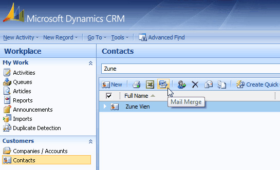
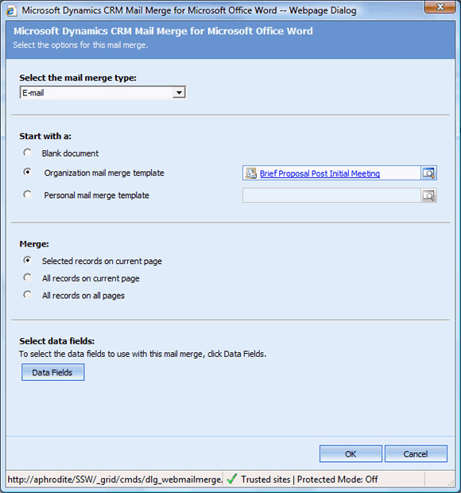
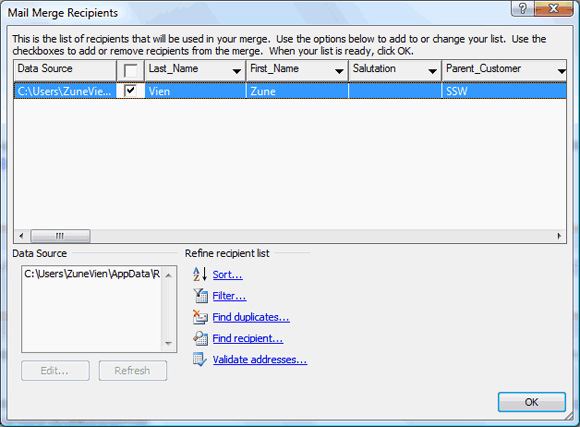
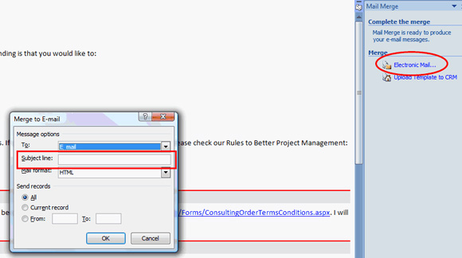
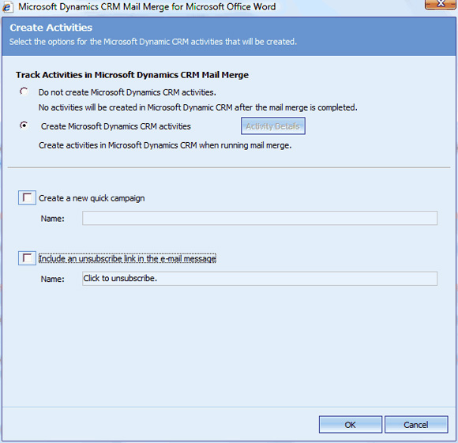

You can use mail merge template, to send email to account, contact... Each mail merge template is associated to an entity, and you can only use the mail merge template that associated to the entity you're sending email to. In the following instructions, I'm sending email to the contact entity:
 
1. From Dynamics CRM, click         **Contacts** to view the list of contacts.
2. Search for the contact that you want to send email to.
3. Highlight the contact that you want to send email to, and click the mail merge button.

5. At         **Start with a** , select either personal mail merge template (this is your own template), or the organization template (this is the template that is used by the whole organizaion).
6. At         **Merge** , check         **Selected records on current page** check box.
7. Click         **Ok**

[[greyBox]]
|  
| # Attention
| 
| If you don't see a contact in the recipient list, that means your contact either:
| 
|     - **Do Not Emails** or
|     - **Do Not Bulk Emails** field set to be
|     - **Do Not Allow**
| 
|  
9. Follow the on screen instructions in Microsoft Word and edit the content of the email that you want to send.

# Attention: SSW Developers

Please remove the yellow highlight for the block of the text that need to be filled in by you and the green highlight for the CRM field while you're editing the email.

10. At the last step of the mail merge instructions in Microsoft Word, click         **Electronic Mail** and fill in the subject line for your email.

12. Now because we're using CRM 4 Outlook, CRM mail merge will give you an option to create the activities that associated to this email. Check         **Create Microsoft Dynamic CRM Activities** radio button, and uncheck the         **Include an ubsubcribe link in the email message** to create the activities.

