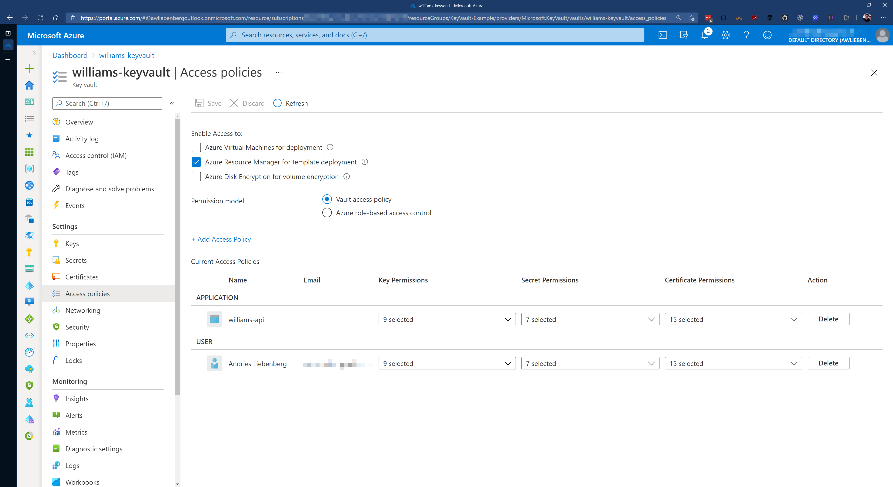
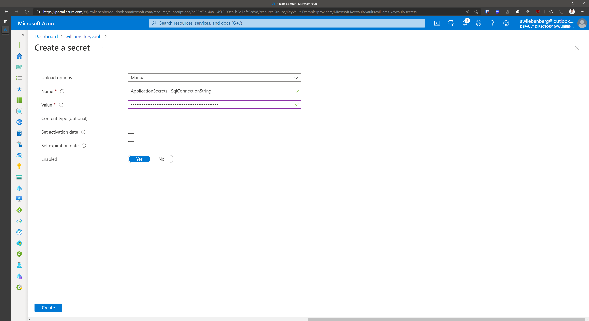

There are multiple configuration providers available such as the JSON file provider (`appsettings.json` and `appsettings.*.json`), Environment variables, Commandline arguments, and also Azure Key Vault.

All the configu `IConfiguration` ...

<!--endintro-->


```cs
public class MyDataService
{
    private async Task<string> GetCustomerDetails(CustomerDetailsQuery request)
    {
        var sql = @"SELECT * FROM CustomerDetails WHERE CustomerId = @auctionId";
        await using var db = new SqlConnection("Server=localhost;Database=Northwind;Trusted_connection=false;user id=sa;pwd=admin");
        return (await db.QueryAsync<string>(sql,
            new
            {
                customerId = request.CustomerId
            })
            ).SingleOrDefault();
    }
}
```

::: bad
Bad Example - Option #1 Connection strings do not belong in your code, anyone seeing this could access your database
:::

```js
// In appsettings.json
{
  "ApplicationSecrets": {
    "LicenceKey": "ABCD-1234-HIJK",
    "ConnectionString": "Server=localhost;Database=Northwind;Trusted_connection=false;user id=sa;pwd=admin"
  }
}
```

::: bad
Bad Example - Option #2 Connection strings do not belong in your appsettings.json either, once committed to version control they are hard to remove
:::

```cs
public class MyDataService
{
    public readonly string _connectionString;
    public MyDataService(IConfiguration config)
    {
        // In Production, your connection string will be read from Key Vault instead of appsettings.json
        _connectionString = config["ApplicationSecrets:SqlConnectionString"];
    }
    private async Task<string> GetCustomerDetails(CustomerDetailsQuery request)
    {
        var sql = @"SELECT * FROM CustomerDetails WHERE CustomerId = @auctionId";
        await using var db = new SqlConnection(_connectionString);
        return (await db.QueryAsync<string>(sql,
            new
            {
                customerId = request.CustomerId
            })
            ).SingleOrDefault();
    }
}
```

::: bad
Bad Example - Option #3 Referencing a loosely typed connection string defined in application settings
:::

```cs
// In ApplicationSecrets.cs
public class ApplicationSecrets
{
    public string SqlConnectionString { get; set; }
    public string LicenseKey { get; set; }
}
```

::: good
The strongly typed class containing application secrets
:::

```cs
// In Startup.cs
// This method gets called by the runtime. Use this method to add services to the container.
public void ConfigureServices(IServiceCollection services)
{
    // Bind the "ApplicationSecrets" config section to an instance of the `ApplicationSecrets` class
    services.Configure<ApplicationSecrets>(Configuration.GetSection("ApplicationSecrets"));
    ...
}
```

::: good
Binding the application secrets section an instance of the `ApplicationSecrets` class
:::

```cs
// In MyDataService.cs
public class MyDataService
{
    public readonly ApplicationSecrets _settings;
    
    public MyDataService(ApplicationSecrets settings)
    {
        // In Production, your connection string will be read from Key Vault
        _settings = settings;
    }
    
    private async Task<string> GetCustomerDetails(CustomerDetailsQuery request)
    {
        var sql = @"SELECT * FROM CustomerDetails WHERE CustomerId = @auctionId";
        await using var db = new SqlConnection(_settings.SqlConnectionString);
        return (await db.QueryAsync<string>(sql,
            new
            {
                customerId = request.CustomerId
            })
            ).SingleOrDefault();
    }
}
```

::: good
Consuming strongly typed application secrets
:::

## Integrating Azure Key Vault into your ASP.NET Core application

In .NET 5, we use **Azure Key Vault** to securely store our connection strings away from prying eyes.

Azure Key Vault is great for keeping your secrets secret because you can control access to the vault via Access Policies. The access policies allows you to add Users and Applications with customized permissions. Make sure you enable the System assigned identity for your App Service, this is required for adding it to Key Vault via Access Policies.

You can integrate Key Vault directly into your [ASP.NET Core application configuration](https://docs.microsoft.com/en-us/aspnet/core/security/key-vault-configuration?view=aspnetcore-5.0). This allows you to access Key Vault secrets via 'IConfiguration'. 

```cs
public static IHostBuilder CreateHostBuilder(string[] args) =>
	Host.CreateDefaultBuilder(args)
		.ConfigureWebHostDefaults(webBuilder =>
		{
			webBuilder
				.UseStartup<Startup>()
				.ConfigureAppConfiguration((context, config) =>
				{
					if (context.HostingEnvironment.IsProduction())
					{
						IConfigurationRoot builtConfig = config.Build();

						// If running as "Production" from our local environment (not in Azure), then use the Azure CLI credential provider. This means you
						// have to log in via `az login` on your command line before running the local app as Production.
            // To run as a "Production" app locally, change the ASPNETCORE_ENVIRONMENT value to "Production".
						TokenCredential cred = context.HostingEnvironment.IsProduction() ? new DefaultAzureCredential(false) : new AzureCliCredential();

						var keyvaultUri = new Uri($"https://{builtConfig["KeyVaultName"]}.vault.azure.net/");
						var secretClient = new SecretClient(keyvaultUri, cred);
						config.AddAzureKeyVault(secretClient, new KeyVaultSecretManager());
					}
				});
		});
```

::: good
Good Example - Option #4 For a complete example, refer to this [sample application](https://github.com/william-liebenberg/keyvault-example).
:::

### Setting up your Key Vault correctly

In order to access the secrets in Key Vault, you (as User) or an Application must have been granted permission via a Key Vault Access Policy.

Applications require at least the LIST and GET permissions, otherwise the Key Vault integration will fail to retrieve secrets.

::: good

:::

Azure Key Vault and App Services can easily trust each other by making use of System assigned identities. Azure takes care of all the complicated logic behind the scenes for these two services to communicate with each other - reducing the complexity for application developers.

So, make sure that your Azure App Service has the **System assigned identity** enabled.

Once enabled, you can create a Key Vault Access policy to give your App Service permission to retrieve secrets from the Key Vault.

::: good

:::

Adding secrets into Key Vault is easy.

1. Create a new secret by clicking on the **Generate/Import** button
2. Provide the **name**
3. Provide the secret **value**
4. Click **Create**

::: good

:::

::: good

:::

As a result of storing secrets in Key Vault, your Azure App Service configuration (app settings) will be nice and clean. You should not see any fields that contain passwords or keys. Only basic configuration values.

::: good

:::

`youtube: https://www.youtube.com/embed/-aTlON-UCVM`

::: good 
Watch SSW's William Liebenberg explain Connection Strings and Key Vault in more detail
:::

### History of Connection Strings:

In .NET 1.1 we used to store our connection string in a configuration file like this:   

```xml
<configuration>
     <appSettings>
          <add key="ConnectionString" value ="integrated security=true;
           data source=(local);initial catalog=Northwind"/>
     </appSettings>
</configuration>
```

and access this connection string in code like this:

```cs
SqlConnection sqlConn = 
new SqlConnection(System.Configuration.ConfigurationSettings.
AppSettings["ConnectionString"]);
```
::: bad
Historical example - old ASP.NET 1.1 way, untyped and prone to error.
:::

In .NET 2.0 we used strongly typed settings classes:

Step 1: Setup your settings in your common project. E.g. Northwind.Common

  

Step 2: Open up the generated App.config under your common project. E.g. Northwind.Common/App.config

Step 3: ~~Copy the content into your entry applications app.config. E.g. Northwind.WindowsUI/App.config~~ The new setting has been updated to app.config automatically in .NET 2.0

```xml
<configuration>
      <connectionStrings>
         <add name="Common.Properties.Settings.NorthwindConnectionString"
              connectionString="Data Source=(local);Initial Catalog=Northwind;
              Integrated Security=True"
              providerName="System.Data.SqlClient" />
        </connectionStrings>
 </configuration>
```
Then you can access the connection string like this in C#

```cs
SqlConnection sqlConn =
 new SqlConnection(Common.Properties.Settings.Default.NorthwindConnectionString);
```
::: bad
Historical example - access our connection string by strongly typed generated settings class...this is no longer the best way to do it 
:::
